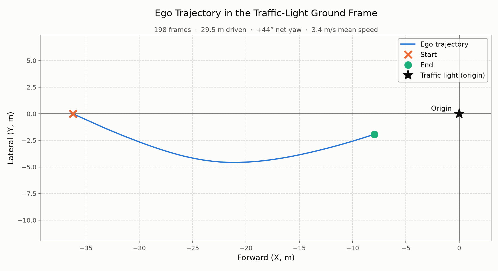

# Ego-Trajectory Reconstruction (Part A)

Ego-vehicle ground-plane trajectory from the fixed traffic light.
[`solution.py`](solution.py) · [`test_solution.py`](test_solution.py) · full write-up: [`PLAN.md`](PLAN.md)

```bash
pip install -r requirements.txt
python solution.py        # -> trajectory.png, trajectory.mp4, diagnostics.png
python -m unittest test_solution
```



*X = start, dot = end, star = the light at the origin. The path is horizontal, not vertical
like the sample, because the brief puts the car→light line on +X at t₀ — so the car starts on
the −X axis with the light dead ahead.*

## Method

1. **Detections.** Parse the bbox CSV (either header spelling), drop degenerate rows, match
   frames to `.npz` files by globbing, not by a filename template.
2. **Light in 3D.** Median of the central 50 % of the bbox — indexed `xyz[v, u]`, not
   `[u, v]` — after dropping non-finite, zero and behind-camera points and MAD-gating range
   outliers, which is what removes background leaking in around the light's silhouette.
3. **Axes measured, not assumed.** "+X forward, +Y right, +Z up, right-handed" cannot all
   hold: forward × right is *down*. Correlating Y against the column index and Z against the
   row index shows this dataset is **+Y left** — right-handed, and already matching the world
   frame. Y is flipped only if a dataset says otherwise.
4. **World frame.** Origin under the light, +Z up through it, car→light on +X at t₀, so the
   ego position is `p_t = −R(ψ_t)·c_t`.
5. **Heading.** No IMU, but physics is free: **a car cannot drive sideways.** With the ψ_t as
   unknowns (ψ₀ fixed by the frame definition), the non-holonomic constraint — the chord
   `p_{t+1} − p_t` lies along the mean of the two headings — is one scalar equation per step
   in one unknown, solved by bisection as a forward recursion. It returns a constant heading
   on a straight drive, and frame gaps don't disturb it because the constraint links
   *samples*, not consecutive frames. Positions are smoothed by local linear regression over
   a ±6-frame *time* window; a boxcar would flatten the turn and mishandle the sparse frames.

## Assumptions and limitations

- **Planar motion** — flat ground, fixed camera pitch/roll, yaw only; height is dropped.
- **Constant curvature within a step** — exact for an arc, close enough at 30 fps.
- **Stereo error grows with range²**, so the earliest samples (~36 m) are least reliable — the
  speed spike in the first ~0.3 s of `diagnostics.png`. Left in: it is a real measurement.
- **198 of 299 frames** have depth (38–127 sparse) and 4 CSV rows are degenerate. Failing
  frames are dropped, not interpolated.

## Results

198 frames, source 38–298 (8.67 s). The car approaches on a left-curving road and pulls up
behind a golf cart at the intersection — which is what the video shows.

| | |
|---|---|
| Path length | **29.5 m** (net displacement 28.3 m) |
| Net yaw | **+43.9°**, a left turn |
| Mean speed | **3.4 m/s** (7.6 mph), decelerating to a near-stop |
| Extent | X ∈ [−36.2, −8.0] m, Y ∈ [−4.6, 0.0] m; ends 8.2 m short of the light |

**Validation** — there is no ground truth, so the checks are internal:

- *The light's height must be constant*, since a fixed light cannot move. **3.59 ± 0.14 m**
  over 198 frames: the strongest evidence the estimator locks onto the light, not background.
- *Solver residual* — sideslip is the constraint the heading solve drives to zero, so a step
  it failed to bracket would surface here. **p95 0.000°.**
- *Track identity* — the bbox centre moves smoothly and its width grows monotonically
  20 → 88 px: one light throughout, not several on the span wire.
- *Tests* — 24 cases, no dataset needed; recovers synthetic arcs to ~1e-4 m and pins the
  `[v, u]` index order.

`diagnostics.png` plots range, bearing, speed and recovered yaw over time.
Part B (golf cart, barrels, pedestrians in a richer BEV) was not attempted.
