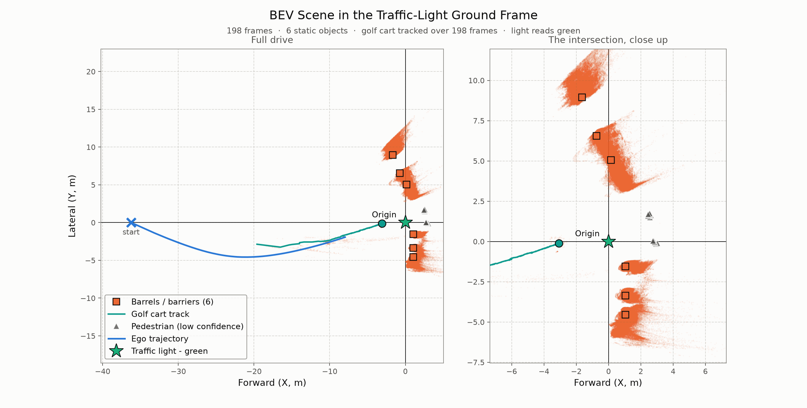

# Ego-Trajectory & BEV Mapping

**Part A** — ego ground-plane trajectory from the fixed traffic light.
**Part B** — barrels, golf cart, workers and light state, in that same frame.
`numpy` + `matplotlib` only. Full rationale: [`PLAN.md`](PLAN.md).

```bash
pip install -r requirements.txt
python solution.py   # -> trajectory.png, trajectory.mp4, diagnostics.png
python part_b.py     # -> bev.png, bev.mp4, detections.png
python -m unittest test_solution test_part_b      # 60 tests, no dataset needed
```


## Part A — ego trajectory ([`solution.py`](solution.py))

- **Light in 3D** — median of the central 50 % of the bbox, indexed `xyz[v, u]` *not*
  `[u, v]`, after dropping bad points and MAD-gating range outliers.
- **Axes measured, not assumed** — "+Y right, right-handed" cannot both hold (forward ×
  right is *down*). Correlating Y against the column index: this data is **+Y left**.
- **World frame** — origin under the light, car→light on +X at t₀, so `p_t = −R(ψ_t)·c_t`.
  That definition is why the path runs horizontally, unlike the sample.
- **Heading** — no IMU, but physics is free: *a car cannot drive sideways*. With the ψ_t as
  unknowns, that constraint gives one equation per step in one unknown, solved by bisection
  as a forward recursion. It yields a constant heading on a straight drive, and links
  *samples*, so frame gaps do not disturb it.

**Result** — 198 frames, 38–298 (8.67 s): path **29.5 m**, net yaw **+43.9°** left, mean
speed **3.4 m/s** slowing to a near-stop, ending 8.2 m short of the light. A left-curving
approach pulling up behind a golf cart — what the video shows.

## Part B — the rest of the scene ([`part_b.py`](part_b.py))

`p_t + R(ψ_t)·v` pushes any camera-frame point into that same world frame, so 198 frames
accumulate into one map. Colour thresholds plus depth geometry; no learned model.

- **Barrels / barriers** — orange, gated 0.15–1.8 m above the road (the light *housings* are
  the same amber, but hang at 5.4 m). Static, so they accumulate over the clip and are
  located as **density peaks**: connected components merge a whole row, because each object
  is a dense head with a tail pointing away from where the car stood. **6 found.**
- **Golf cart** — pale tan canopy, tracked **198/198 frames**, closing 16.9 → 5.2 m ahead.
- **Pedestrians** — the weak layer, labelled low-confidence on the plot. Torso-band
  clustering merges into the fence and standoff fails, because the workers stand ~1 m in
  front of a same-height barrier. The cue that works — both wear blue — is *clip-specific*.
- **Light state** — amber housings outvote the lamp on hue, so the lamp is isolated on
  brightness first (V ≈ 0.85 vs 0.56). **Green on all 198 frames.**



## Assumptions and limitations

- **Planar motion** — flat ground, fixed pitch/roll, yaw only; the road measures 1.79 m
  below the camera, sd 0.026 m. Constant curvature within a step: exact for an arc.
- **Stereo error grows with range²** along the viewing ray, so distant objects smear into
  radial streaks — one barrel scatters 0.10 m at 9–12 m but 0.81 m past 30 m. Objects are
  located only inside 20 m (12 m for pedestrians).
- **198 of 299 frames** have depth (0–37 absent, 38–126 sparse); 4 bbox rows are degenerate.
  Failing frames are dropped, not interpolated.
- Barrels and barriers are not told apart, and no object is given an extent.

## Validation — no ground truth, so every check is internal

| Check | Result |
|---|---|
| Light height must be constant | **3.59 ± 0.14 m** over 198 frames |
| Solver residual (sideslip) | **p95 0.000°** — every step bracketed |
| Static objects must not move | per-frame centroid scatter **median 0.39 m**, p90 0.57 m |
| Golf cart must stay ahead | 16.9 → 5.2 m, never behind us |
| Tests | **60**, synthetic, no dataset needed |

The static-object row tests *Part A*: a barrel cannot move, so a drifting trajectory would
walk its centroid across the map. `detections.png` projects every mask back onto the RGB.
